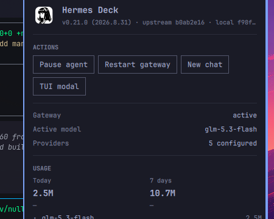

# Hermes Deck

[](https://github.com/mbot11/omarchy-hermes-deck/actions/workflows/ci.yml)
A desktop surface for [Hermes Agent](https://hermes-agent.nousresearch.com) on [Omarchy](https://omarchy.org): a bar glyph that reflects agent state, a panel with status, sessions, usage, and kanban, controls for the emergency stop and gateway, and a drop-down TUI modal. One plugin.
A persistent service-kind daemon polls the Hermes state database read-only; everything else is QML, bash, and argument validation. Tests, docs, and a threat model ship in the repo.

```bash
omarchy plugin add https://github.com/mbot11/omarchy-hermes-deck.git --enable
```

## What it does



| Area | Behavior |
|---|---|
| Bar glyph | State-colored: cyan pulse while the agent works, amber while paused, red when the gateway is down. Right-click toggles the TUI modal. |
| Status | Gateway state with connected messaging platforms (Telegram, Slack, etc.) and active background task count, active model, configured auth providers, and Omarchy default agent badge. |
| Actions | Pause/resume the agent (`hermes pause`/`resume` emergency stop), restart the gateway (`hermes gateway restart`), start a new chat, open the native desktop app (`hermes-desktop`), or set as Omarchy default coding agent; destructive actions need a confirming second click. |
| Sessions | Recent conversations with title, age, workspace, model, and origin badges (`[Desktop]`, `[Telegram]`, `[CLI]`); clicking one resumes it in the TUI. |
| Usage | Today and 7-day token totals with Hermes' own cost estimates, broken down by model. |
| Kanban | Read-only board summaries from `hermes kanban boards list --json`. |
| TUI modal | Quake-style drop-down terminal running `hermes --tui` on a Hyprland special workspace; survives shell restarts. |

Desktop notifications fire when the agent finishes long work, when the emergency stop engages or lifts, and when the gateway service changes state. Disable with the **notify** widget setting.

## Requirements

- Omarchy (Quattro shell); the plugin uses the `service` + `bar-widget` kinds
- [Hermes Agent](https://hermes-agent.nousresearch.com) installed (`omarchy default agent hermes` or `omarchy install ai hermes`); every surface degrades gracefully when Hermes is absent
- Python 3 (stdlib only, no pip packages)

## Install

```bash
omarchy plugin add https://github.com/mbot11/omarchy-hermes-deck.git --enable
omarchy plugin enable io.github.mbot11.hermes-deck
```

The glyph lands on the right bar section. Optional hotkeys in `~/.config/hypr/bindings.lua`:

```lua
o.bind("SUPER + SHIFT + H", "Hermes Deck panel", "omarchy-shell io.github.mbot11.hermes-deck toggle")
o.bind("SUPER + ALT + H", "Hermes TUI modal", "omarchy-shell io.github.mbot11.hermes-deck.modal toggle")
```

## Settings

Open the bar settings for the widget:

| Key | Default | Meaning |
|---|---|---|
| `showKanban` | true | Show the Kanban section |
| `notify` | true | Desktop notifications for agent events |

## Privacy

The plugin reads Hermes' state database read-only and makes no network requests itself. It never opens `auth.json`, `.env`, or credential stores; the one nuance is that it executes `hermes auth list`, which is Hermes reading its own auth state internally, and the plugin keeps only provider names and counts. Hermes itself (TUI, gateway, messaging platforms) communicates externally by design. See [SECURITY](docs/SECURITY.md).

## Troubleshooting

See [TROUBLESHOOTING](docs/TROUBLESHOOTING.md). Quick checks:

```bash
~/.config/omarchy/plugins/io.github.mbot11.hermes-deck/scripts/deck-collect | jq .
omarchy-shell shell rescanPlugins
omarchy restart shell
```

## Attribution

- Drop-down TUI modal pattern: bscott's MIT-licensed Scratch Terminal, via ElChacoVeloz/omarchy-hermes-modal.
- Service-discovery and pulse-glyph patterns: Snitch (MIT) and the Omarchy first-party widgets.

## License

MIT, see [LICENSE](LICENSE).
